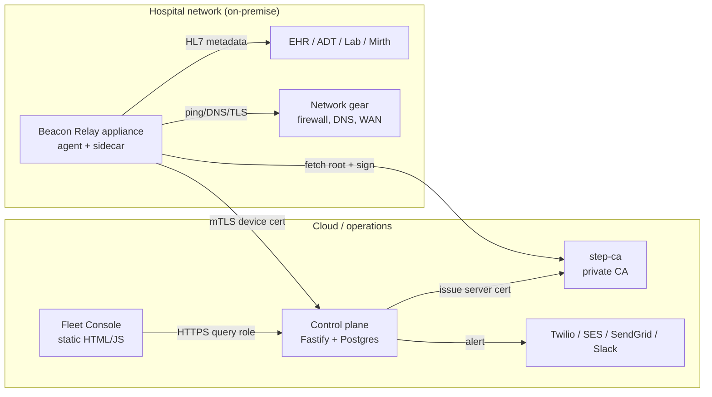

# Beacon Relay Architecture

This document describes the major components of Beacon Relay, how they connect, and where the trust boundaries are.

## System diagram

## Trust boundaries

| Boundary | What crosses it | How it is protected |
|---|---|---|
| **Device ↔ Control plane** | Metadata-only check_result events, heartbeats, OTA bundles | Mutual TLS with step-ca-issued short-lived certs; device pins CA root and verifies server cert (H1); control plane verifies device cert and registry state. |
| **Device ↔ step-ca** | CSR/sign round-trips, root cert fetch | HTTPS with CA fingerprint pin at enrollment; one-time JWK tokens for signing. |
| **Control plane ↔ Postgres** | All persisted state | Compose-internal network only (not published to host); password auth required. |
| **Control plane ↔ Public internet** | Outbound alerts to Twilio/SES/SendGrid/Slack | HTTPS with pinned SaaS endpoints; PHI guard scans every channel before send (M1). |
| **Console ↔ Control plane** | Operator reads and writes | HTTPS; currently query-string role stub (C1), must be replaced with real IdP + MFA before production. |
| **Appliance boundary** | Physical device, TPM/LUKS keys, disk image | LUKS-encrypted data partition or TPM-sealed keys; signed RAUC bundles for OTA. |

## Components

### Edge appliance (`beacon-relay-agent/`)

- **agent.js**: main daemon. Heartbeats, cert renewal, continuous monitoring, OTA polling, downtime UI.
- **provision.js**: first-boot enrollment. Generates keys, redeems enrollment token, issues mTLS cert via step-ca.
- **lib/update.js**: OTA client. Downloads signed RAUC bundle, verifies signature, installs to inactive slot, reboots; post-boot health check marks new slot good or bad (H2).
- **lib/tls_pin.js**: pinned CA root and strict server-cert verification for every control-plane call (H1).
- **lib/monitor_loop.js**: runs scheduled checks and posts metadata-only events.
- **lib/downtime.js**: local UI served when the WAN/control plane is down.
- **lib/tpm.js**: TPM detection and key sealing; falls back to LUKS software keyfile.

### Control plane (`control-plane/`)

- **src/index.js**: Fastify entrypoint. Obtains step-ca server cert, registers routes, serves static console.
- **src/routes/*.js**: HTTP route handlers. Every route declares a `config.auth` policy (`device`, `operator:<perm>`, or `public`) (H3).
- **src/db.js**: persistence layer. PostgreSQL in production, SQLite fallback for local dev.
- **src/alerting.js**: escalation engine and escalation sweep.
- **src/deliver.js**: alert delivery to Twilio, SES, SendGrid, Slack/Teams webhooks with PHI guard (M1).
- **src/rbac.js**: role-to-permission map and `requirePerm` preHandler.
- **public/**: static Fleet Console pages.

### Private CA (`pki-config/`)

`step-ca` runs as a Docker service. It issues short-lived certificates for the control-plane server and for each enrolled device. The CA intermediate key is protected by `CA_PASSWORD`; the provisioner JWK is mounted as a Docker secret.

### HL7 sidecar (`sidecar/`)

A Python service that receives HL7 v2 messages from the hospital network, extracts only metadata (message type, timestamp, source/destination, error counts), and posts safe events to the control plane. No message content or patient identifiers leave the appliance.

### Image pipeline (`pipeline/`)

Bash and Node scripts that:
1. Bake runtime configuration into the rootfs.
2. Build the RAUC bundle and sign it with the release-signing key.
3. Produce a bootable disk image.

## Data flow

1. **Enrollment**: provision.js generates a device key, redeems a one-time enrollment token from the control plane, pins the CA root, and obtains an mTLS cert from step-ca.
2. **Monitoring**: agent.js runs checks against EHR interfaces and network services, posting metadata-only `check_result` events to the control plane over mTLS.
3. **Alerting**: the control plane's escalation sweep fires alerts when rules match; deliver.js sends them through configured channels after PHI scanning.
4. **OTA**: agent.js polls for a new signed bundle, verifies the signature, installs to the inactive RAUC slot, reboots, and runs a post-boot health check.
5. **Support**: an operator requests a remote-support session; the device polls over mTLS, consumes a one-time JIT token, and opens an outbound tunnel.
